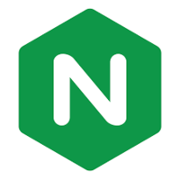
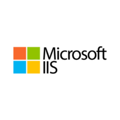
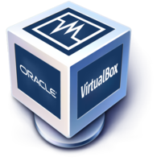
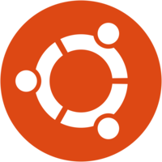

---
Name: Richard Taveras 
Semester: Spring 24
Class: Cis 106
--- 

# Deliverable Submission 

## Basic Terminology

 

### What is a web server? Hardware and software side
A web server is both a hardware and software system responsible for serving web content to clients over the internet.
* **<u>Hardware</u>**: This usually refers to the physical server machine (computer) that hosts the web server software and serves web pages to users.
* **<u>Software</u>**: It refers to the software application that runs on the server hardware and responds to HTTP requests from clients (web browsers), delivering web pages and other resources.

### What are some different web server applications?
| Application Name | License                          | Project's Website               |
| ---------------- | -------------------------------- | ------------------------------- |
| Nginx        | 2-Clause BSD-like License | [example 1](https://www.nginx.com/) |
| Apache HTTP Server        | Apache License 2.0               | [example 2](https://httpd.apache.org/) |
| Microsoft Internet Services (IIS)        | Proprietary Software                      | [example 3](https://www.iis.net/) |

#### Example 1: Nginx
 
A lightweight, high-performance web server and reverse proxy server known for its efficiency in handling concurrent connections and serving static content.
#### Example 2: Apache HTTP Server
 
A powerful, open-source web server software known for its flexibility, stability, and extensive module support.

#### Example 3: Microsoft Internet Information Services (IIS)
 
A web server software developed by Microsoft for use on Windows servers, providing support for various web technologies and integration with other Microsoft products.

#### What is virtualization?
Virtualization is the process of creating a virtual (rather than physical) version of something, such as an operating system, server, storage device, or network resource. It allows multiple virtual instances of hardware or software to run on a single physical machine, enabling better resource utilization and flexibility.

#### What is virtualbox?

VirtualBox is a free and open-source virtualization software that allows users to create and manage virtual machines (VMs) on their computer. It provides a platform for running multiple guest operating systems (OS) simultaneously on a single physical host.

#### What is a virtual machine?
A virtual machine (VM) is a software emulation of a physical computer system that runs on a physical host machine. It behaves like a physical computer, running an operating system and applications, but it is entirely contained within a software environment.

#### What is Ubuntu Server?

Ubuntu Server is a variant of the Ubuntu operating system designed specifically for server environments. It provides a stable and secure platform for running various server applications, including web servers, databases, email servers, and more.

#### What is a firewall?
A firewall is a network security device or software application that monitors and controls incoming and outgoing network traffic based on predetermined security rules. It acts as a barrier between a trusted internal network and untrusted external networks (such as the internet), helping to prevent unauthorized access and attacks.

#### What is SSH?
SSH (Secure Shell) is a cryptographic network protocol used for secure remote login and command execution over an insecure network. It provides encrypted communication between two hosts, typically connecting a client to a server securely over an untrusted network, such as the internet.