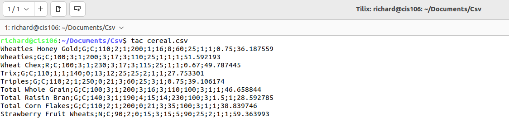

---
Name: Richard Taveras 
Semester: Spring 24
Class: Cis 106
--- 

# Lab 7

## Question 1
### #1

### #2

### #3

### #4

### #5

## Question 2
### #1

### #2

### #3

### #4

### #5

## Question 3
### #1

### #2

### #3 & 4

### #5

### #6

### #7

### #8

### #9

### #10

