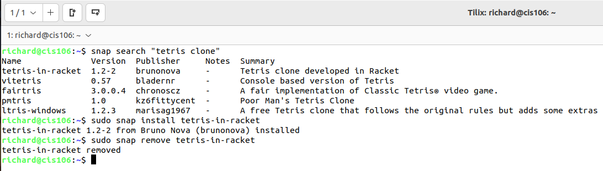

# Week Report 3
## Completed work for week 3
* [Lab 3](../../labs/lab3/lab3.md)
* [Notes 1](../../notes/notes1/notes1.md)

### Practice 2: Accessing the bash shell
 

### Practice 3: Using the command history
 

### Practice 4: My first shell script

### Practice 5: Using man

### Practice 6: Using the help option

### Practice 7: Cheat!
 

### Practice 1: Managing Software

### Practice 3: Installing and removing snaps
  